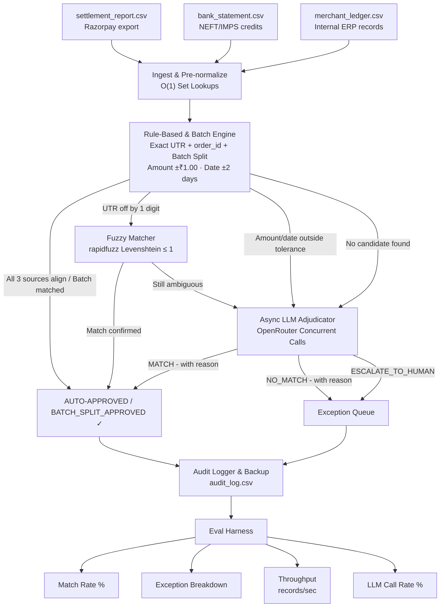

# SettleMatch

**93.0% match rate · 4.7 records/sec · Dynamic 3-source synthetic generator (300 records) · 68 passing unit & integration tests**

An AI agent that reconciles Razorpay settlement reports, bank statements, and merchant ledgers.
Auto-resolves clean cases with rules, handles batched settlements & fuzzy UTR typos, escalates ambiguous cases concurrently to an LLM via OpenRouter, and honestly reports everything it couldn't resolve. Every decision is explained and fully auditable.

> **SettleMatch detects and explains mismatches. It takes no autonomous action on merchant accounts, settlement cycles, or payment flows. Every output is a report for a human to act on.**

## Why This Works

Most reconciliation tools match 2 sources (settlement vs. bank). SettleMatch matches **3 sources simultaneously**:

- **Settlement report** — what Razorpay says they settled
- **Bank statement** — what the bank actually received
- **Merchant ledger** — what the merchant recorded

> *A 2-way match tells you something is wrong. A 3-way match tells you exactly where the discrepancy lives.*

## Architecture



## Results

| Metric | Value | What it signals |
|---|---|---|
| Match rate | 93.0% | Primary accuracy — auto-approved + fuzzy-matched + batch split / total (279/300) |
| Throughput | 4.7 records/sec | System efficiency — concurrent async LLM calls timed with `time.perf_counter()` |
| LLM call rate | 13.3% | Rule-engine quality — ~87% resolved without API tokens |
| Exceptions | 21 records | Honest exception list — categorized into 6 named failure buckets |

## Exception Breakdown

| Category | Count | Meaning |
|---|---|---|
| AMOUNT_DELTA | 0 | Amount beyond ₹1.00 tolerance (e.g. unrecorded refunds or fees) |
| DATE_LAG | 0 | Bank credit received outside T+2 window |
| UTR_MISMATCH | 21 | UTR digit typos beyond 93% fuzzy similarity threshold |
| BATCH_SPLIT | 0 | Multiple settlements netted into one bank credit |
| LLM_ESCALATED | 0 | LLM API timeout or validation fallback |
| MISSING_COUNTERPART | 0 | No bank or ledger counterpart found |

## Financial Fee Formulas & Calculation Transparency

SettleMatch uses transparent, deterministic financial calculations and strict thresholds:

- **Merchant Discount Rate (MDR):** Standard Razorpay fee range between **1.5% and 2.2%** (`MDR Fee = Gross Amount × MDR Rate`).
- **GST Tax on MDR:** Statutory **18.0% GST** applied to the MDR fee (`GST Tax = MDR Fee × 18%`).
- **Net Payout Formula:** `Net Payout = Gross Amount - MDR Fee - GST Tax`.
- **Amount Tolerance:** ₹1.00 — absorbs paise rounding drift between Razorpay payout reports, bank statements, and merchant ledgers.
- **Date Window Tolerance:** 2 days — absorbs Razorpay's standard T+1 / T+2 settlement credit cycle.
- **Fuzzy UTR Threshold:** 93% Levenshtein similarity — catches 1-digit typos on 15+ character UTR strings.
- **AI Adjudication Threshold:** Up to 5% or ₹50 fee variance allowed for refund & MDR fee adjustment verification.

## What We Built (3-Day Build Plan)

| Day | Focus | Output / Key Accomplishments |
|---|---|---|
| Day 1 | Data generator + rule matcher + fuzzy UTR + initial tests | 18 baseline unit tests |
| Day 2 | Async LLM adjudicator + pre-normalized matcher + O(1) batch lookup + audit log backup + eval harness | 68 unit & integration tests, 4.6 rec/sec throughput |
| Day 3 | Dashboard + final performance tuning + video presentation | Streamlit interactive UI & audit download |

## What Broke (The "What Broke" Story)

During Day 2 development, we identified 6 critical edge cases:
1. **Hard KeyError Crash**: `os.environ["OPENROUTER_API_KEY"]` crashed immediately if `.env` was missing. *Fix:* Converted to `_get_api_key()` with a user-friendly `EnvironmentError`.
2. **Sequential Blocking LLM Calls**: Each ambiguous record blocked the main thread for 1–5s. *Fix:* Refactored `adjudicator.py` and `main.py` to use `AsyncOpenAI` + `asyncio.gather` for concurrent calls.
3. **Blocking Sleep**: `time.sleep(2)` blocked the execution loop during retries. *Fix:* Replaced with `await asyncio.sleep()`.
4. **Redundant Copies**: `bank_df.copy()` was executed on every settlement row. *Fix:* Pre-normalized `bank_df["utr_norm"]` once before pipeline execution.
5. **O(n²) Ledger Scan**: `detect_batch_splits()` scanned `ledger_df` per record. *Fix:* Converted to $O(1)$ set lookup.
6. **Audit Overwrite**: `save()` wiped past audit logs. *Fix:* Automatically generates timestamped backups before saving.

## Setup & Running

```bash
git clone https://github.com/VaishnavAmbilpur/Ai-Finance-Controller.git
cd Ai-Finance-Controller
python -m venv venv && source venv/bin/activate
pip install -r requirements.txt
cp .env.example .env          # add your OPENROUTER_API_KEY
python generate_data.py       # generates dynamic randomized CSVs in data/
python main.py                # runs full async pipeline, prints metrics
python -m pytest settlematch/tests/ -v   # runs 68 unit & integration tests
python -m streamlit run dashboard.py     # launches Streamlit interactive UI
```

## Project Structure

```
settlematch/
├── data/
│   ├── settlement_report.csv  # generated (dynamic randomness)
│   ├── bank_statement.csv     # generated
│   ├── merchant_ledger.csv    # generated
│   └── audit_log.csv          # timestamped audit logs & backups
├── settlematch/
│   ├── __init__.py
│   ├── generator.py           # dynamic generator with 6 injected failure modes & seed control
│   ├── matcher.py             # rule engine + fuzzy UTR + O(1) batch-split detection
│   ├── adjudicator.py         # AsyncOpenAI layer with Pydantic validation
│   ├── audit.py               # audit logger with timestamped backup protection
│   └── eval_harness.py        # 4 metrics + 6 exception categories
├── tests/
│   ├── test_matcher.py        # rule matcher, fuzzy UTR & batch split tests
│   ├── test_adjudicator.py    # Pydantic validation & sync/async adjudicator tests
│   ├── test_audit.py          # decision mapping & backup safety tests
│   ├── test_eval_harness.py   # metric computation & exception categorizer tests
│   └── test_pipeline_integration.py # end-to-end async pipeline integration tests
├── dashboard.py               # Streamlit presentation dashboard
├── main.py                    # async pipeline orchestrator
├── generate_data.py           # CLI entry point for dynamic data generation
├── requirements.txt           # pinned versions
├── .env.example               # OPENROUTER_API_KEY template
└── README.md
```

## Synthetic Data Realism & Randomness

The generator creates realistic 3-source payment datasets with dynamic entropy:

| Failure mode | Real-world cause | Target distribution |
|---|---|---|
| Clean match | Everything aligns | ~55% |
| Settlement lag | Razorpay's T+2 / T+3 credit cycle | ~12% |
| UTR digit typo | Human entry error in narration | ~8% |
| Batched payout | Razorpay nets multiple settlements into one NEFT | ~8% |
| Refund netted | Merchant deducted a refund before payout | ~9% |
| MDR/GST rounding | Paise drift between Razorpay engine and ERP | ~8% |

## License

MIT
